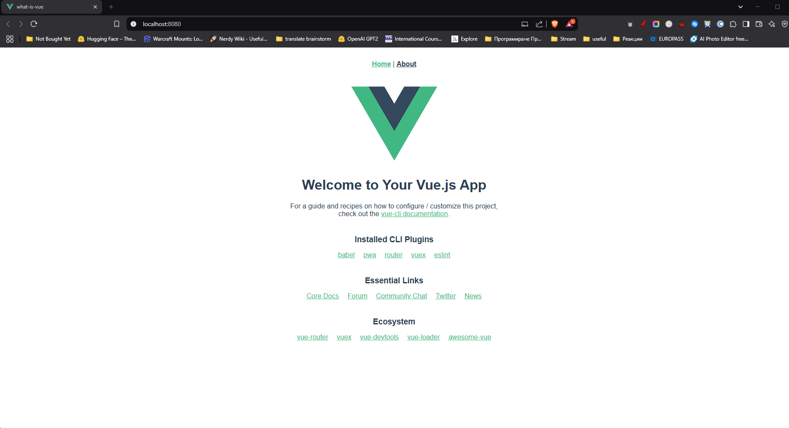

## Installation of VUE CLI 
> Here I will be using more of my thought and actual Steps process. 
>> We came to a conclusion with my GPT Fifi that we are going to use the Vue CLI 
>>> For some reason Fifi got confused and assumed I have Node.js installed (which I do) and we are starting by installing the VUE CLI globally on my machine
>>> ```npm install -g @vue/cli```
>>>  
>>>> *it is looking alright, but maybe I should have used something other than npm as package manager* 💭
>>>>> `vue --version`
>>>>> 

## Initializing Vue Project
```
vue create what-is-vue
```
> Creating the project in the command line of the root of the repository giving it a name 'what-is-vue' 
>>  *picked yes, but tracking it in case it causes issues along the way*
>>> Fifi suggested I add these manually (3rd option), but I will consult what is the best step to proceed with some context before I continue with this:  
>>>> in this issue the next steps and thinking process are disclosed: https://github.com/gerryjekova/What-is-Vue/issues/3#issue-2854454366 
>>>>> I decided to add the additional Progressive Web App (PWA) Support for potential experimental purposes in the future 💭⭐
>>>>> 
>>>>>>> Final config looks like this: 
>>>>>>>> moved to app directory -> `cd what-is-vue` -> then ran script to launch the development server `npm run serve` 
>>>>>>>> 
>>>>>>>>> -> App is working on local: 
