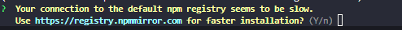

# [How to Start the App](https://github.com/gerryjekova/What-is-Vue/blob/main/Docs/Project/WIV-1.md)
- Firstly I went to my [Custom GPT - Fifi](https://chatgpt.com/g/g-674259cb1c0881919c42c6a6d42ea0be-fifi).
> a Custom GPT is just ChatGPT with extra customizations tailored to specific needs. Fifi is my custom GPT that I have made for the purpose of studying, analysis, brainstorming & project management. I have trained her for these purposes, therefore I prefer to use her for this, rather than just normal ChatGPT. 
- There are issues and milestones to visualize the steps and processes & also show I know my way around Github and other collaborative software. 
- There will be further commits with the steps I take broken down intuitively and I will also commit them step-by-step to make the processes I go through visible. 
- Any future conversations with Fifi or any AI in regards to the project will also be stored in their own .md file in the [Docs](https://github.com/gerryjekova/What-is-Vue/tree/main/Docs/AI-Brainstorming) dedicated directory. 
- Docs/Project is for the documented step by step processes and my thoughts along the way just like the one below. That is WIV-1.md - my first notes on starting the Vue app. 


## Installation of VUE CLI 
> Here I will be using more of my thought and actual Steps process. 
>> We came to a conclusion with my GPT Fifi that we are going to use the Vue CLI 
>>> For some reason Fifi got confused and assumed I have Node.js installed (which I do) and we are starting by installing the VUE CLI globally on my machine
```
npm install -g @vue/cli
```
>>>  
>>>> *it is looking alright, but maybe I should have used something other than npm as package manager* 💭
```
vue --version
```
>>>>> 

## Initializing Vue Project
```
vue create what-is-vue
```
> Creating the project in the command line of the root of the repository giving it a name 'what-is-vue' 
>>  *picked yes, but tracking it in case it causes issues along the way*
>>> Fifi suggested I add these manually (3rd option), but I will consult what is the best step to proceed with some context before I continue with this:  
>>>> in this issue the next steps and thinking process are disclosed: https://github.com/gerryjekova/What-is-Vue/issues/3#issue-2854454366 
>>>>> I decided to add the additional Progressive Web App (PWA) Support for potential experimental purposes in the future 💭⭐
>>>>> 
>>>>>>> Final config looks like this: 
>>>>>>>> moved to app directory ->
```
cd what-is-vue
```
- then ran script to launch the development server
```
npm run serve
``` 
>>>>>>>> 
>>>>>>>>> -> App is working on local: 
